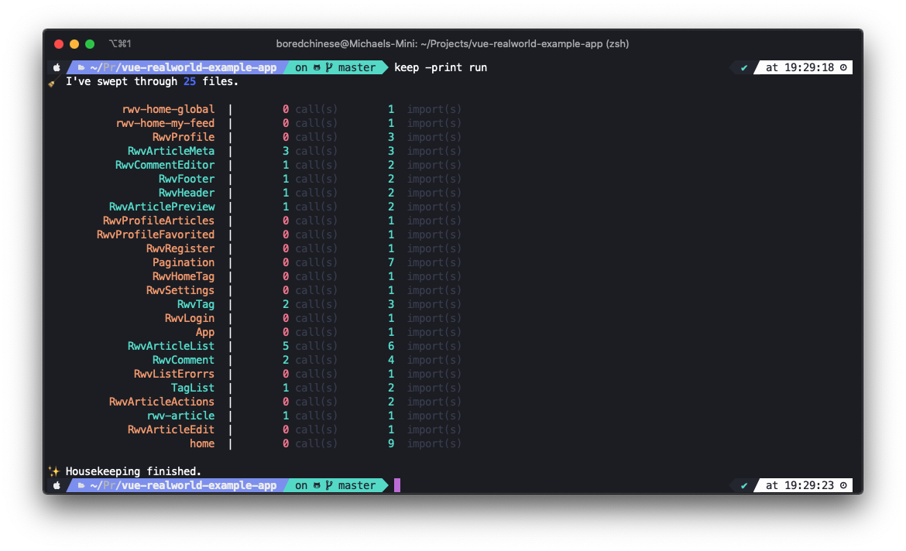

# 🧹 Housekeep
Keep track how often your Vue components are used.



## Installing

1. [Download](https://github.com/boredchinese/housekeep/releases) and unzip

2. Move `keep` to `usr/local/bin`

```bash
mv keep /usr/local/bin
```

3. Test if your terminal recognizes `keep`

```bash
keep -v
```

## Getting Started

Run `keep` on a Vue project

```bash
keep -d path-to-project/src/ -p run
```

## Flags

- `-d` or `-dir`: The directory of your Vue project
- `-p` or `-print`: Print the result in CLI
- `-l` or `-log`: Logs debugging information to `debug.log` and is saved wherever `keep` is moved to.
- `-h` or `-help`: For help 

## Authors

* **Bored Chinese** - *Initial work* - [BoredChinese](https://github.com/boredchinese)

## License

This project is licensed under the GNU General Public License v3.0 - see the [LICENSE](LICENSE) file for details
